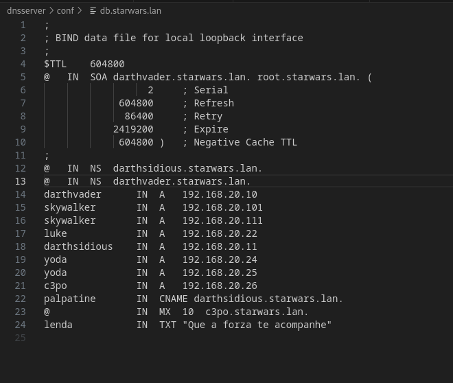

# INSTALACION DE ZONAS PRIMARIAS

### 1- Instala o servidor BIND9 no equipo darthvader. Comproba que xa funciona coma servidor DNS caché pegando no documento de entrega a saída deste comando dig @localhost www.edu.xunta.es

**COMPROBACION DE FICHEROS DE CONFIGURACION Y ZONAS**

**Salida ejercicio 1**

### 2- Configura o servidor BIND9 para que empregue como reenviador 8.8.8.8. pegando no documento de entrega contido do ficheiro /etc/bind/named.conf.options e a saída deste comando: dig @localhost www.mecd.gob.es 

**Cambios en /etc/bind/named.conf.options**

**Salida del comando del fichero**

### 3- Instala unha zona primaria de resolución directa chamada "starwars.lan" e engade os seguintes rexistros de recursos (a maiores dos rexistros NS e SOA imprescindibles):

####   Tipo A: darthvader con IP 192.168.20.103
####     Tipo A: skywalker con IP 192.168.20.101
####     Tipo A: skywalker con IP 192.168.20.111
####     Tipo A: luke con IP 192.168.20.22
####     Tipo A: darthsidious con IP 192.168.20.11
####     Tipo A: yoda con IP 192.168.20.24 e 192.168.20.25
####     Tipo A: c3p0 con IP 192.168.20.26
####     Tipo CNAME palpatine a darthsidious
####     TIPO MX con prioridade 10 sobre o equipo c3po
####     TIPO TXT "lenda" con "Que a forza te acompanhe"
####     TIPO NS con darthsidious

###  Pega no documento de entrega o contido do arquivo de zona, e do arquivo /etc/bind/named.conf.local

#### NAMED.CONF.LOCAL

#### ZONA DIRECTA

### 4- Instala unha zona de resolución inversa que teña que ver co enderezo do equipo darthvader, e engade rexistros PTR para os rexistros tipo A do exercicio anterior. Pega no documento de entrega o contido do arquivo de zona, e do arquivo /etc/bind/named.conf.local

#### ZONA INVERSA

### 5-     Comproba que podes resolver os distintos rexistros de recursos. Pega no documento de entrega a saída dos comandos:

#### nslookup darthvader.starwars.lan localhost

#### nslookup skywalker.starwars.lan localhost

#### nslookup starwars.lan localhost

#### nslookup -q=mx starwars.lan localhost

#### nslookup -q=ns starwars.lan localhost

#### nslookup -q=soa starwars.lan localhost

#### nslookup -q=txt lenda.starwars.lan localhost

#### nslookup 192.168.20.11 localhost

